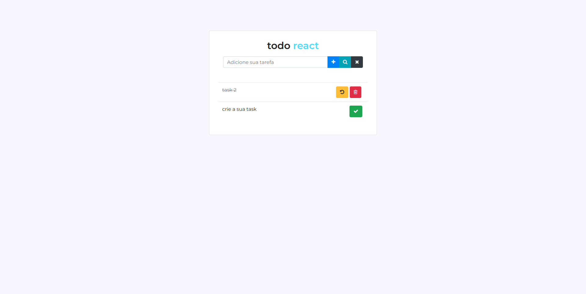

[](https://github.com/feross/standard)

<h1 align="center">todo <span style="color: #61DBFB;">react</span></h1>

This is one of those projects that every developer ends up doing with their first contact with a new language.
<p>The <b>todo <span style="color: #61DBFB;">react</span></b> is a very simple application for creating and organizing tasks.</p>
This was my first ReactJS project, and I made him in two versions, one with Redux and one without.

<!--  -->

### :rocket: Demo
<p>The deploy was made on <b>Netlify</b> and you can access in here https://todo-react-cvs.netlify.app/</p>

<p><b>PS:</b> The first request (when creating the first task) will take a while to return an answer because the API will be in "hibernate" mode.
The "hibernate" "mode happens because the API doesn't get a lot of constant access.</p>

## Technologies
- HTML && CSS
- ReactJS
- Webpack
- The state management <b>Redux</b>
- Deployed on <b>Netlify</b>

## Installation
Download NPM, Node and MongoDB.

Clone and configure the backend [todo react API.](https://github.com/carolvasc/todo-react-api)

Clone this repo locally:
```sh
$ git clone https://github.com/carolvasc/todo-react.git
```
Install the dependencies:
```
$ npm install
```
Open your terminal and run the application:
```sh
$ npm run dev
```

If the whole process has gone smoothly, an application available at `localhost:8080`.

<br />
<h5>Versão 1.0</h5>
